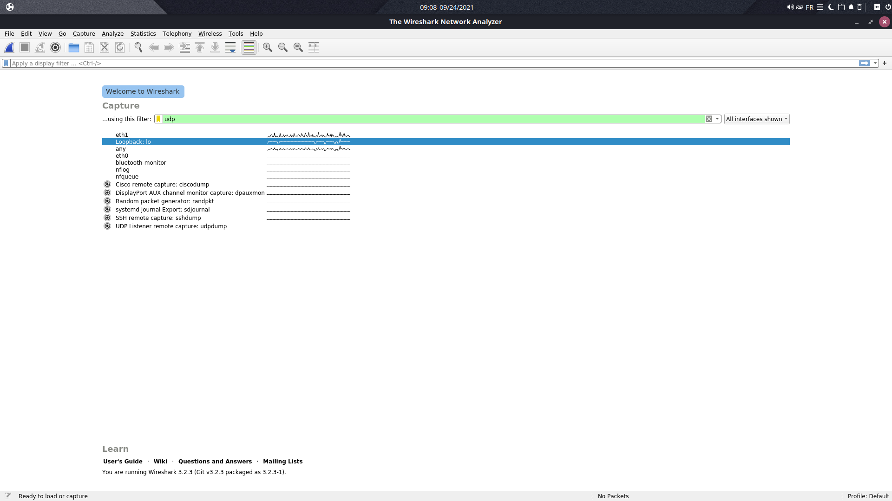
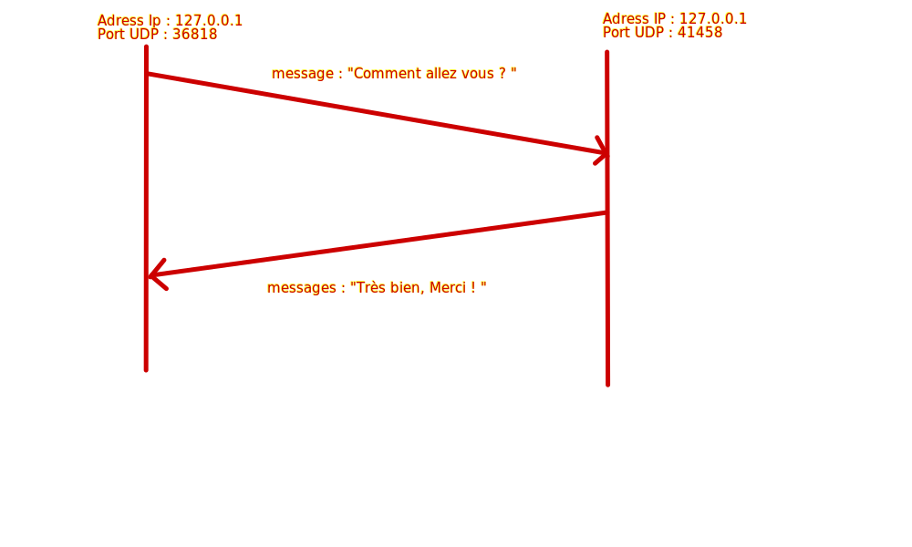

# Rapport pour le TP1

## UDP

### Exercice 1

Nous avons lancé la commande suivante:

```
ip address show dev eth0
```

L'adresse Ipv4 associé à l'interface ethernet de mon ordinateur est:

```
192.168.5.56
```

### Exercice 2

Nous avons lancé socklab, puis nous avons lancé la commande suivante :

```
socket udp
```

Et l'ID de la socket est 3

### Exercice 3

En lançant la commande :

```
status
```

Nous avons obtenu :

```
 Id  Proto   Local address              Remote address             TYPE  RWX ?
 ---------------------------------------------------------------------------
>3   UDP U   -                          -                          ipv4  .W.

```

### Exercice 4

Nous avons lancé la commande:

```
bind 3 192.168.5.56 3000
```

### Exercice 5

Nous avons lancé la commande:

```
sendto 3 192.168.5.57 3000 "Romain"
```

### Exercice 6

Mon voisin doit me fournir son port et son adresse IP


### Exercice 7 (revoir le nombre de bits à lire avec recvfrom)

Nous avons lancé la commmande suivante:

```
recvfrom 3 1
```

Et j'ai bien reçu un message de la part de mon voisin:

```
A message of length 1 bytes was received from b05p7.fil.univ-lille1.fr (3000).
Message=<B>
```

### Exercice 8*

Il est préférable de laisser le système choisir le port sur les 2 machines

### Exercice 9

Nous avons lancé la commmande suivante:

```
close 3
```

Pour supprimer la socket créée précédement

### Exercice 10

- Nous avons créés 2 socket udp:

```
socklab> socket udp
The socket identifier is 3
```

```
socklab> socket udp
The socket identifier is 4
```

- Puis pour les associer à toutes les adresses IP et à un port libre choisi par le systeme, nous avons lancé la commande:

```
bind 3 * 0
```
et
```
bind 4 * 0
```

- Et nous avons eu les résultats suivants:

```
The socket was attributed port 41458.
```
et
```
The socket was attributed port 36818.
```

Pour vérifier que tout s'est bien passé correctement nous avons lancé la commande status:

```
 Id  Proto   Local address              Remote address             TYPE  RWX ?
 ---------------------------------------------------------------------------
 3   UDP U   *(41458)                   -                          ipv4  .W.
>4   UDP U   *(36818)                   -                          ipv4  .W.

```

### Exercice 11

Nous avons lancé la commande:

```
sudo wireshark -i lo -f udp
```

et une fenêtre wireshark s'est ouverte

### Exercice 12

Nous avons lancé la commande:

```
ip address
```

et nous avons trouvé l'adresse IPv4 suivante pour le loopback:

```
127.0.0.1
```

### Exercice 13

Nous avons envoyé un message à l'aide de la commande suivante:

```
sendto 3 127.0.0.1 41458 "Comment allez-vous ?"
```

### Exercice 14

Puis nous avons répondu à l'aide de la commande suivante:

```
sendto 4 127.0.0.1 36818 "Très bien, Merci ! "
```

### Exercice 15

Analyse de la capture:



- a) Nous avons vérifié et les adresses correspondent bien

- b)



- c) Deux segments udp ont été transmis

- d)*

### Exercice 16

Pour supprimer les sockets nous avons effectué les commandes suivantes:

```
close 3
```
et
```
close 4
```

---

## TCP

### Exercice 1

Pour créer ces deux sockets tcp nous avons lancé les commandes suivantes:

```
socklab> socket tcp
The socket identifier is 3

socklab> socket tcp
The socket identifier is 4

socklab> bind 3 192.168.5.72 3000

socklab> bind 4 192.168.5.72 4000
```

### Exercice 2

Nous avons ouvert un nouveau terminal et avons effectué la commande suivante:

```
sudo wireshark -i lo -f 'tcp port 3000' &
```

Ce qui a ouvert une fenêtre wireshark

### Exercice 3
Nous avons lancé la commande suivante:

```
ss -ant4
```

Et nous avons obtenu:

```
State      Recv-Q  Send-Q   Local Address:Port      Peer Address:Port  Process  
LISTEN     0       3            127.0.0.1:2601           0.0.0.0:*              
LISTEN     0       3            127.0.0.1:2602           0.0.0.0:*              
LISTEN     0       64             0.0.0.0:41707          0.0.0.0:*              
LISTEN     0       511          127.0.0.1:6379           0.0.0.0:*              
LISTEN     0       3            127.0.0.1:2604           0.0.0.0:*              
LISTEN     0       4096           0.0.0.0:111            0.0.0.0:*              
LISTEN     0       5              0.0.0.0:62354          0.0.0.0:*              
LISTEN     0       1024     127.0.0.53%lo:53             0.0.0.0:*              
LISTEN     0       128            0.0.0.0:22             0.0.0.0:*              
LISTEN     0       1024           0.0.0.0:50999          0.0.0.0:*              
LISTEN     0       999            0.0.0.0:31416          0.0.0.0:*              
LISTEN     0       100            0.0.0.0:25             0.0.0.0:*              
LISTEN     0       5            127.0.0.1:61209          0.0.0.0:*              
TIME-WAIT  0       0         192.168.5.72:48672     52.84.174.94:443            
TIME-WAIT  0       0         192.168.5.72:40256     52.84.174.73:443            
ESTAB      0       0         192.168.5.72:38328      10.140.2.45:389            
TIME-WAIT  0       0         192.168.5.72:39160    35.82.131.108:443            
ESTAB      0       0         192.168.5.72:790        172.18.12.8:2049           
TIME-WAIT  0       0         192.168.5.72:40254     52.84.174.73:443            
TIME-WAIT  0       0         192.168.5.72:58930    23.200.86.251:80             
ESTAB      0       0         192.168.5.72:42654    34.215.30.193:443            
TIME-WAIT  0       0         192.168.5.72:47886     172.18.15.11:8080           
TIME-WAIT  0       0         192.168.5.72:40258     52.84.174.73:443            
ESTAB      0       0         192.168.5.72:56088   35.244.181.201:443            
ESTAB      0       0         192.168.5.72:33446     52.84.174.84:443            
ESTAB      0       0         192.168.5.72:53038      172.18.12.8:636  
```

### Exercice 4

Nous avons lancé la commande suivante:

```
connect 3 192.168.5.72 4000
```

Et nous avons eu comme résultat:

```
connect(): Connection refused
```

La connexion a été refusé

### Exercice 5

Nous avons lancé la commmande suivante:

```
listen 4 1
```
Pour que la socket d'ID 4 soit mise en écoute passive

### Exercice 6

- La socket qui est mise en écoute passive est la socket serveur (4)

- La socket qui se connecte est la socket client (3)

### Exercice 7

Nous avons relancé la commande suivante:

```
connect 3 192.168.5.72 4000
```

Et cette fois la connexion a été réussi

On constate qu'ils ont tous reçu un signal en même temps

### Exercice 8

Nous avons lancé la commmande suivante:

```
accept 4
```

Et nous avons eu comme résultat:

```
A connection from b05p22.fil.univ-lille1.fr (3000) was received.
Connection is established, with socket ID 5.
```


### Exercice 9

En faisant la commmande status nous avons obtenu:

```
socklab> status
 Id  Proto   Local address              Remote address             TYPE  RWX ?
 ---------------------------------------------------------------------------
 3   TCP     192.168.5.72(3000)         192.168.5.72(4000)         ipv4  .W.
 4   TCP     192.168.5.72(4000)         -                          ipv4  ...
>5   TCP     192.168.5.72(4000)         192.168.5.72(3000)         ipv4  .W.

```

On constate donc qu'une nouvelle socket d'ID 5 s'est créée

### Exercice 10

Nous avons lancé la commmande suivante:
```
socklab> write 3 "Comment allez-vous ?"
Sent 20 bytes
```

### Exercice 11

#### a)

Il y aurait eu l'envoi mais pas la reception

#### b)*

#### c)*

#### d)*

### Exercice 12

En lançant la commande ss-ant4, la ligne suivante est apparu:
```
ESTAB      20      0         192.168.5.72:4000      192.168.5.72:3000 
```

Le champ Recv-Q contient le nombre 20 (le nombre de bytes du message envoyé)

### Exercice 13

Nous avons lancé la commande suivante:
```
socklab> read 5 20
Read 20 bytes: message=<Comment allez-vous ?>
```

L'id de la socket est l’identifiant renvoyé par la
commande accept

### Exercice 14

Le champ Recv-Q n'est plus présent

### Exercice 15

Nous avons lancé la commande suivante:

```
shutdown 3 out
```

la socket S1 n'est plus connecté à la socket S2, on ne peut donc plus envoyé de message
On en déduit que la commande précédente coupe la connexion entre les deux sockets

### Exercice 16

Pour répondre au message nous avons lancé la commande suivante:

```
socklab> write 5 "Tres bien. Merci !"
Sent 18 bytes
```

Puis nous avons lu le message en effectuant la commande suivante:

```
socklab> read 3 20
Read 18 bytes: message=<Tres bien. Merci !>
```

### Exercice 17

D'après wireshark, la commande shutdown permet de "dégager" le message qu'elle possède(ses bytes)

---

## Retransmissions et contrôle de flux

---

Pas fait


