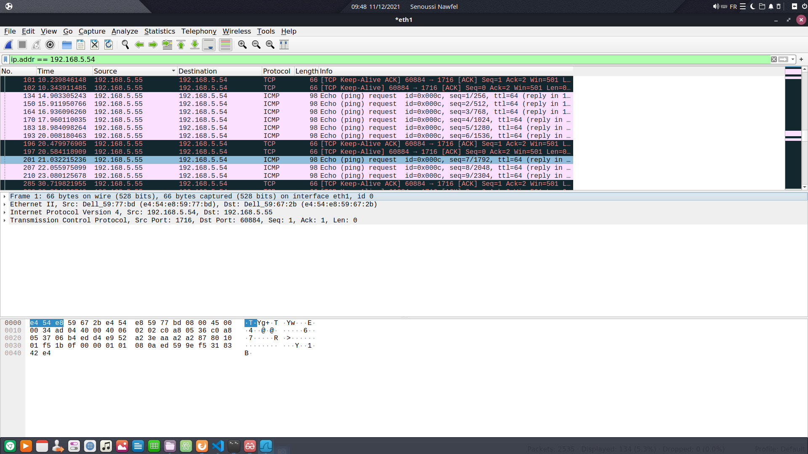

# Rapport pour le TP4 : Liaison de données


## Adressage

1. Sur votre machine, quel est le nom de l’interface connectée au réseau de la salle de TP ? Quelle est son
adresse IPv4 ? Quelle est son adresse IPv6 ? Quelle est son adresse MAC ?

Pour avoir des informations sur les adresses ip de la machine, nous devons lancé la commande suivante:

```
senoussin@b05p5:~/Documents/2021-rsx-1-t-ps-groupe-miage-1$ ip address
```

Et nous avons eu comme résultat:
```
1: lo: <LOOPBACK,UP,LOWER_UP> mtu 65536 qdisc noqueue state UNKNOWN group default qlen 1000
    link/loopback 00:00:00:00:00:00 brd 00:00:00:00:00:00
    inet 127.0.0.1/8 scope host lo
       valid_lft forever preferred_lft forever
    inet6 ::1/128 scope host 
       valid_lft forever preferred_lft forever
2: eth0: <NO-CARRIER,BROADCAST,MULTICAST,UP> mtu 1500 qdisc htb state DOWN group default qlen 1000
    link/ether 30:b5:c2:04:d4:c5 brd ff:ff:ff:ff:ff:ff
3: eth1: <BROADCAST,MULTICAST,UP,LOWER_UP> mtu 1500 qdisc fq_codel state UP group default qlen 1000
    link/ether e4:54:e8:59:67:2b brd ff:ff:ff:ff:ff:ff
    inet 192.168.5.55/24 brd 192.168.5.255 scope global dynamic eth1
       valid_lft 12757sec preferred_lft 12757sec
    inet6 fe80::e654:e8ff:fe59:672b/64 scope link 
       valid_lft forever preferred_lft forever

```

Le nom de l'interface connecté au réseau de la salle TP est l'interface **eth1**

- Adresse IPv4 => **192.168.5.55/24**
- Adresse IPv6 => **fe80::e654:e8ff:fe59:672b/64**
- Adresse MAC  => **e4:54:e8:59:67:2b**

2. Donnez les principales caractéristiques de cette interface : quelle est sa vitesse actuelle ? Est-ce la vitesse
maximale supportée par l’interface ? Quel le mode de duplex ? Vérifiez que l’interface est bien
connectée.

Pour avoir des informations sur une interface, nous devons lancé la commande suivante:

```
senoussin@b05p5:~/Documents/2021-rsx-1-t-ps-groupe-miage-1$ sudo ethtool eth1
```

Et nous avons eu comme résultat:

```
Settings for eth1:
	Supported ports: [ TP ]
	Supported link modes:   10baseT/Half 10baseT/Full 
	                        100baseT/Half 100baseT/Full 
	                        1000baseT/Full 
	Supported pause frame use: No
	Supports auto-negotiation: Yes
	Supported FEC modes: Not reported
	Advertised link modes:  10baseT/Half 10baseT/Full 
	                        100baseT/Half 100baseT/Full 
	                        1000baseT/Full 
	Advertised pause frame use: No
	Advertised auto-negotiation: Yes
	Advertised FEC modes: Not reported
	Speed: 1000Mb/s
	Duplex: Full
	Port: Twisted Pair
	PHYAD: 1
	Transceiver: internal
	Auto-negotiation: on
	MDI-X: on (auto)
	Supports Wake-on: pumbg
	Wake-on: g
	Current message level: 0x00000007 (7)
			       drv probe link
	Link detected: yes

```

- Vitesse actuelle => **Speed: 1000Mb/s**
- **
- Mode de duplex => **Duplex: Full**
- **L'interface est bien connecté (Link detected: yes)**


3. Quelle est la classe de l’adresse IPv4 ? Quel est son masque ? Quelle est l’adresse du réseau au format
CIDR ? Quelle est l’adresse de broadcast ? Combien d’hôtes peut-on adresser sur ce réseau ? Cette
adresse est-elle routable au sein d’un réseau local ? Est-elle routable sur internet ?

Nous avons relancé la commande de l'exercice 1 pour avoir des informations sur les adresses ip:

```
ip address
```

- Classe => **C** car compris entre 192.0.0.0 et 223.255.255.255 
- Masque => **24**
- Adresse réseau au format CIDR => **192.168.5.0** (on remplit à l'aide du masque, ici 24)
- Adresse broadcast => 192.168.5.255
- Nombre d'hôtes adressable => **2 puissance 8 - 2** ou 2 puissance (32 - 24) - 2 = **254**
- Routable en réseau local => **Oui** car elle est unique au sein de notre réseau
- Routable sur internet => **Non** car cette adresse fait partie d'une classe privée (classe C)


4. Écrivez les 16 octets de l’adresse IPv6 sans abréviation. Écrivez en dessous les 16 octets du masque.
Combien d’hôtes peut-on adresser sur ce réseau ? Cette adresse est-elle routable au sein d’un réseau
local ? Est-elle routable sur internet ? Quelle est l’étendue (scope) de cette adresse ?

- Adresse IPv6 (sans abréviation) => **fe80:0000:0000:0000:e654:e8ff:fe59:672b/64**

- Les 16 octets du masque => **ffff:ffff:ffff:ffff:0000:0000:0000:0000** (masque 64)

- Nombre d'hôtes adressable => 128 - 64 = 64 ; Donc **2 puisssance 64 - 2**

- **

- Elle fait partie d'une classe privée et donc n'est pas routable sur internet

- L'étendu (scope) est **link** (inet6 fe80::e654:e8ff:fe59:672b/64 scope link)

   Affichez la table de routage. Quelle est l’adresse de la passerelle IP ?

    Nous avons lancé la commande suivante pour afficher la table de routage:

    ```
    senoussin@b05p5:~/Documents/2021-rsx-1-t-ps-groupe-miage-1$ ip route
    default via 192.168.5.1 dev eth1 
    default via 192.168.5.1 dev eth1 proto dhcp src 192.168.5.55 metric 100 
    169.254.0.0/16 dev eth1 scope link metric 1000 
    192.168.5.0/24 dev eth1 proto kernel scope link src 192.168.5.55 
    192.168.5.1 dev eth1 proto dhcp scope link src 192.168.5.55 metric 100 
    ```

    - Adresse IPv4 de la passerelle => **192.168.5.1**

5. Avec Wireshark, lancez une capture de trames sur l’interface connectée au réseau de la salle de TP.
Testez la connectivité IPv4 et IPv6 avec votre voisin.

- Pour tester la connectivité IPv4 avec mon voisin, j'ai lancé la commande suivante:

```
senoussin@b05p5:~/Documents/2021-rsx-1-t-ps-groupe-miage-1$ ping 192.168.5.54
```

Et nous avons eu le résultat suivant:

```
PING 192.168.5.54 (192.168.5.54) 56(84) bytes of data.
64 bytes from 192.168.5.54: icmp_seq=1 ttl=64 time=0.571 ms
64 bytes from 192.168.5.54: icmp_seq=2 ttl=64 time=0.672 ms
64 bytes from 192.168.5.54: icmp_seq=3 ttl=64 time=0.481 ms
64 bytes from 192.168.5.54: icmp_seq=4 ttl=64 time=0.516 ms
^C
--- 192.168.5.54 ping statistics ---
4 packets transmitted, 4 received, 0% packet loss, time 3062ms
rtt min/avg/max/mdev = 0.481/0.560/0.672/0.072 ms
```

- - Pour tester la connectivité IPv6 avec mon voisin, j'ai lancé la commande suivante:

```
senoussin@b05p5:~/Documents/2021-rsx-1-t-ps-groupe-miage-1$ ping6 fe80:0000:0000:0000:e654:e8ff:fe59:77bd%eth1
```

Et nous avons eu le résultat suivant:

```
PING fe80:0000:0000:0000:e654:e8ff:fe59:77bd%eth1(fe80::e654:e8ff:fe59:77bd%eth1) 56 data bytes
64 bytes from fe80::e654:e8ff:fe59:77bd%eth1: icmp_seq=1 ttl=64 time=1.02 ms
64 bytes from fe80::e654:e8ff:fe59:77bd%eth1: icmp_seq=2 ttl=64 time=0.229 ms
64 bytes from fe80::e654:e8ff:fe59:77bd%eth1: icmp_seq=3 ttl=64 time=0.819 ms
^C
--- fe80:0000:0000:0000:e654:e8ff:fe59:77bd%eth1 ping statistics ---
3 packets transmitted, 3 received, 0% packet loss, time 2012ms
rtt min/avg/max/mdev = 0.229/0.688/1.018/0.335 ms
```

- Nous sommes obligé d'indiquer l'interface car c'est une adresse locale


6. Arrêtez la capture . La transmission qui nous intéresse est noyée parmi d’autres trames qui nous
parasitent.
Pour simplifier la lecture, filtrez la capture de manière à ce que soient affichées uniquement les trames
émises par votre machine ou à destination de votre machine. Attention : les trames ethernet ne
contiennent pas toujours un paquet IP.
Pour savoir comment utiliser les filtres d’affichage, référez-vous à l’aide de Wireshark :
[https://www.wireshark.org/docs/wsug_html_chunked/ChWorkDisplayFilterSection.html](https://www.wireshark.org/docs/wsug_html_chunked/ChWorkDisplayFilterSection.html)

- Pour la connectivité IPv4:



- Pour la connectivité IPv6:


7. Quel est le protocole utilisé pour tester la connectivité IP ? Ce protocole est le couteau suisse d’IP. Il ne
sert pas seulement à tester la connectivité IP. Quel est le type et le code des messages de requête et de
réponse ?

- Protocole utilisé => **ICMP**
- **Il est utilisé pour véhiculer des messages de contrôle et d'erreur pour cette suite de protocoles (Wikipedia)**

8. La plupart des protocoles réseau permettent, dans l’entête, de spécifier quel est le type du contenu
véhiculé.
Donnez le code du contenu de la trame ethernet.
Donnez le code du contenu du paquet IP.

- Code de la trame ethernet:


- Code du paquet IP:


   Les paquets IP transmis à votre voisin sont encapsulés dans des trames ethernet. Pour que ces trames parviennent à destination, il faut connaître l’adresse ethernet de votre voisin. Cette adresse est aussi appelée adresse matérielle ou adresse MAC (Media Access Control), ou encore adresse de couche liaison..

9. Avant l’envoi du ping IPv4, un échange de messages ARP (Address Resolution Protocol) a eu lieu. Quelle
est l’adresse matérielle de destination de la requête ? Que signifie cette adresse ? Quelle est la question
posée par la requête ?


- Adresse matérielle de destination de la requête => **Dell_59:77:bd**
- Cette adresse est **l'adresse Mac de mon PC**
- La question posée par la requête est **"Who has 192.168.5.54"**


10. Avant l’envoi du ping IPv6, un échange de messages ICMPv6 de type Neighbor Solicitation et Neighbor
Advertisement a eu lieu. Quelle est l’adresse matérielle de destination de la requête ? Que signifie cette
adresse ? Quelle est l’adresse IP de destination de la requête ? A quoi correspond cette adresse ?


- Adresse MAC => **fe80::e654:e8ff:fe59:77bd**??
- ??
- ??

11. Affichez la liste des correspondances entre adresses IP et adresses ethernet. Vérifiez que l’adresse IPv4 et
l’adresse IPv6 de votre voisin y figurent, associées à son adresse MAC. Attention : les entrées de ce cache
ont une durée de vie limitée à quelques minutes.

    **Remplacez cette phrase avec votre réponse.**

12. A quelles couches du modèle OSI appartiennent les protocoles ethernet, IP, ICMP ?

- Protocoles ethernet => Appartient à la **couche liaison de données** et **la couche physique**

- Protocoles IP => Appartient à la **couche réseau**

- Protocoles ICMP => Appartient à la **couche réseau**

13. Selon vous, de manière générale, pourquoi utilise-t-on l'adresse IP et non uniquement l'adresse MAC pour
les communications réseaux ?

    **Remplacez cette phrase avec votre réponse.**

## Point-à-point

Chaque machine de la salle dispose d’au moins 2 interfaces ethernet. Laissez votre machine connectée à la prise EXT, qui vous permet d’atteindre internet ou votre homedir. Utilisez une autre interface ethernet pour la connecter à la machine de votre voisin, en point-à-point, via la
baie de brassage.

1. Vous utilisez un câble droit ou un câble croisé ?

- Nous utilisons un **câble croisé**

2. Quelle commande utilisez-vous pour vérifier que votre interface est bien connectée, et connaître la vitesse
et le mode de duplex qui ont été négociés entre vos deux machines ?

- Pour connaitre les informations sur l'interface, nous avons utilisé la commande suivante:

```
senoussin@b05p5:~/Documents/2021-rsx-1-t-ps-groupe-miage-1/TP4$ sudo ethtool eth0
```

- Et nous avons eu comme résultat:

```
Settings for eth0:
	Supported ports: [ TP MII ]
	Supported link modes:   10baseT/Half 10baseT/Full 
	                        100baseT/Half 100baseT/Full 
	                        1000baseT/Half 1000baseT/Full 
	Supported pause frame use: Symmetric Receive-only
	Supports auto-negotiation: Yes
	Supported FEC modes: Not reported
	Advertised link modes:  10baseT/Half 10baseT/Full 
	                        100baseT/Half 100baseT/Full 
	                        1000baseT/Half 1000baseT/Full 
	Advertised pause frame use: Symmetric Receive-only
	Advertised auto-negotiation: Yes
	Advertised FEC modes: Not reported
	Speed: Unknown!
	Duplex: Unknown! (255)
	Port: MII
	PHYAD: 0
	Transceiver: internal
	Auto-negotiation: on
	Supports Wake-on: pumbg
	Wake-on: d
	Current message level: 0x00000033 (51)
			       drv probe ifdown ifup
	Link detected: no
```


3. Affectez une adresse IPv4 privée de classe A à l’interface ethernet. Notez qu’une adresse IPv6 est déjà
associée à cette interface. Elle a été configurée automatiquement.

    Vous remarquerez qu’une même interface réseau peut très bien être associée à plusieurs adresses IP.

    - Pour créer l'adresse IP de classe A sur l'interface eth0 nous avons lancé la commande suivante:

    ```
    senoussin@b05p5:~/Documents/2021-rsx-1-t-ps-groupe-miage-1/TP4$ sudo ip address add 10.0.0.1/8 dev eth0
    ```

4. Affichez la table de routage. Que constatez-vous ?

- Nous avons afficher la table de routage:

```
senoussin@b05p5:~/Documents/2021-rsx-1-t-ps-groupe-miage-1/TP4$ ip route
default via 192.168.5.1 dev eth1 proto dhcp src 192.168.5.55 metric 100 
10.0.0.0/8 dev eth0 proto kernel scope link src 10.0.0.1 linkdown
192.168.5.0/24 dev eth1 proto kernel scope link src 192.168.5.55 
192.168.5.1 dev eth1 proto dhcp scope link src 192.168.5.55 metric 100
```

- Et nous constatons que l'adresse que nous avons ajouté  (10.0.0.1) est en linkdown, donc n'a pas de lien avec l'exterieur

5. Testez la connectivité avec votre voisin.

- Ensuite, j'ai testé la connectivité avec mon voisin:

```
senoussin@b05p5:~/Documents/2021-rsx-1-t-ps-groupe-miage-1/TP4$ ping 10.0.0.2
PING 10.0.0.2 (10.0.0.2) 56(84) bytes of data.
64 bytes from 10.0.0.2: icmp_seq=1 ttl=64 time=0.700 ms
64 bytes from 10.0.0.2: icmp_seq=2 ttl=64 time=0.509 ms
64 bytes from 10.0.0.2: icmp_seq=3 ttl=64 time=0.468 ms
^C
--- 10.0.0.2 ping statistics ---
3 packets transmitted, 3 received, 0% packet loss, time 2032ms
rtt min/avg/max/mdev = 0.468/0.559/0.700/0.101 ms
```

## Concentrateur (hub)

Brassez votre poste de travail sur le concentrateur (hub) situé dans la baie de brassage.
Assurez-vous que deux de vos voisins y sont connectés également.
Supprimez les filtres de capture et d'affichage préalablement configurés.

1. Lancez une capture de trames sur un poste, et transmettez un ping entre les deux autres postes. Que
constatez-vous ? Déduisez-en la manière dont les données sont transmises par cet équipement. Les
données émises par un poste sont-elles reçues par ce même poste ?

- Nous avons réalisé les manipulations demandés et nous avons eu le résultat suivant sur wireshark:


- **On constate que je reçois les transmissions ICMP**
- **Le hub reçoit le ping transmis et l'envoi à toutes les personnes qui font parties de ce hub**
- ??

2. Recommencez la manipulation en désactivant le mode promiscuous de wireshark. A quoi sert-il ?

- Lorsque nous désactivons le mode promiscuous de wireshark nous constatons que nous ne recevons plus rien

- **Il permet à la carte réseau d'accepter tous les paquets qu'elle reçoit, même si ceux-ci ne lui sont pas adressés**


3. Quel est le mode de duplex des interfaces connectées au hub ? Quelle en est la signification ?

- Nous avons lancé la commande suivante pour avoir des informations sur l'interface eth0:

```
senoussin@b05p5:~/Documents/2021-rsx-1-t-ps-groupe-miage-1$ sudo ethtool eth0
```

Et nous avons constaté que le mode duplex était **Half-duplex**:
```
Duplex: Half
```

- Cela signifie que les données circulent dans un sens ou dans l'autre mais jamais dans les deux sens en même temps

4. Quelles sont les topologies physique et logique du réseau constitué par le concentrateur et les postes qui y
sont connectés ?

- Topologie physique => **étoile**
- Topologie logique => **bus**

5. Lancez la commande « iperf -s » sur un poste et « iperf -c ip_du_serveur » sur un autre poste pour lancer
un test de bande passante. Notez le débit atteint et les valeurs du compteur de collisions (voir annexe)
avant et après la manipulation.
Connectez un poste supplémentaire sur le hub (soit au minimum 4 postes) et réalisez de nouveau la manip
en parallèle sur les deux paires de postes.
Notez le débit atteint et les nouvelles valeurs des compteurs de collisions. Déduisez-en la manière dont
fonctionne un hub.

- Nous avons lancé la commande suivante:

```
senoussin@b05p5:~/Documents/2021-rsx-1-t-ps-groupe-miage-1$ iperf -c 10.1.1.1
```
Et nous avons eu le résultat suivant:

```
------------------------------------------------------------
Client connecting to 10.1.1.1, TCP port 5001
TCP window size: 85.0 KByte (default)
------------------------------------------------------------
[  3] local 10.0.0.3 port 57178 connected with 10.1.1.1 port 5001
[ ID] Interval       Transfer     Bandwidth
[  3]  0.0-10.3 sec  11.9 MBytes  9.63 Mbits/sec
```

- Puis, nous avons effectué la même chose en lançant les deux paires de postes en même temps, et nous avons eu:

```
senoussin@b05p5:~/Documents/2021-rsx-1-t-ps-groupe-miage-1$ iperf -c 10.1.1.7
------------------------------------------------------------
Client connecting to 10.1.1.7, TCP port 5001
TCP window size: 85.0 KByte (default)
------------------------------------------------------------
[  3] local 10.0.0.3 port 33258 connected with 10.1.1.7 port 5001
[ ID] Interval       Transfer     Bandwidth
[  3]  0.0-10.7 sec  5.62 MBytes  4.42 Mbits/sec

```

- On constate que le débit est divisé par 2
- **Le hub renvoi les données reçu à toutes les personnes connectées au hub**

   Les postes connectés entre eux via des concentrateurs forment un **domaine de collision**.


## Commutateur (switch)

Brassez votre poste de travail sur le commutateur (switch) situé dans la baie de brassage.
Assurez-vous que deux de vos voisins y sont connectés également.
Supprimez les filtres de capture et d'affichage préalablement configurés.
Réactivez le mode promiscuous.

1. Lancez une capture de trames sur un poste, et transmettez un ping entre les deux autres postes. Que
constatez-vous ? Déduisez-en la manière dont les données sont transmises par cet équipement.

Nous avons effectué la capture et nous avons eu le résultat suivant:


- **Nous ne recevons rien**
- **Les données sont donc uniquement transmises au réel destinataire**

2. Quel est le mode de duplex des interfaces connectées au hub ? Quelle en est la signification ?

- Nous avons lancé la commande suivante pour avoir des informations sur l'interface eth0:

```
senoussin@b05p5:~/Documents/2021-rsx-1-t-ps-groupe-miage-1$ sudo ethtool eth0
```

Et nous avons constaté que le mode duplex était **Full-duplex**:
```
Duplex: Full
```

- Cela signifie que les données circulent simultanément

3. Quelles sont les topologies physique et logique du réseau constitué par le concentrateur et les postes qui y
sont connectés ?

- Topologie physique => étoile
- Topologie logique  => étoile

4. Lancez la commande « iperf -s » sur un poste et « iperf -c ip_du_serveur » sur un autre poste pour lancer
un test de bande passante. Notez le débit atteint et les valeurs du compteur de collisions (voir annexe)
avant et après la manipulation.
Connectez un poste supplémentaire sur le switch (soit au minimum 4 postes) et réalisez de nouveau la
manip en parallèle sur les deux paires de postes.
Notez le débit atteint et les nouvelles valeurs des compteurs de collisions. Déduisez-en la manière dont
fonctionne un switch.

- Nous avons lancé la commande suivante:

```
senoussin@b05p5:~/Documents/2021-rsx-1-t-ps-groupe-miage-1$ iperf -c 10.1.1.4
```
Et nous avons eu le résultat suivant:

```
------------------------------------------------------------
Client connecting to 10.1.1.4, TCP port 5001
TCP window size:  196 KByte (default)
------------------------------------------------------------
[  3] local 10.0.0.4 port 52656 connected with 10.1.1.4 port 5001
[ ID] Interval       Transfer     Bandwidth
[  3]  0.0-10.0 sec   113 MBytes  94.6 Mbits/sec

```

- Puis, nous avons effectué la même chose en lançant les deux paires de postes en même temps, et nous avons eu:

```
senoussin@b05p5:~/Documents/2021-rsx-1-t-ps-groupe-miage-1$ iperf -c 10.1.1.4
------------------------------------------------------------
Client connecting to 10.1.1.4, TCP port 5001
TCP window size:  187 KByte (default)
------------------------------------------------------------
[  3] local 10.0.0.4 port 58576 connected with 10.1.1.4 port 5001
[ ID] Interval       Transfer     Bandwidth
[  3]  0.0-10.0 sec   113 MBytes  94.6 Mbits/sec

```

- **On constate que le débit reste le même**
- **On peut donc en conclure que le switch n'attend pas pour envoyer ou recevoir, il fait les deux simultanément**

    Pour paramétrer les équipements réseau et obtenir des informations sur leur configuration, il faut établir une
liaison série entre votre poste de travail et le port console de l'équipement en question.
Cette liaison permet d'établir une connexion dite « hors bande », c'est-à-dire en dehors de la bande passante
du réseau ethernet.
Connectez-vous sur le port console d'un switch, noté Sx-C (avec x=R,J,B ou V selon votre baie de brassage).
Utilisez pour cela un câble série DB9-RJ45 (câble bleu et plat) et lancez le programme « minicom ».

    Une fois connecté, tapez sur la touche « entrée » pour afficher le prompt. Si la question « voulez-vous lancer
le setup du switch ? » vous est posée, répondez « non ».
Vous êtes actuellement en mode USER EXEC (prompt >), qui ne permet de lancer qu'un nombre réduit de
commandes, que vous pouvez lister en tapant « ? ». Passez en mode privilégié (prompt #), puis affichez la
table de commutation.

5. Comparez les adresses MAC listées avec celles de vos postes et les ports du switch sur lesquels ils sont
connectés. Comment le switch a-t-il obtenu ces adresses ? Quel est le rôle de la table de commutation
(appelée aussi table d'adresses MAC) ?

Nous avons lancé la commande suivante:

```
senoussin@b05p5:~/Documents/2021-rsx-1-t-ps-groupe-miage-1/TP4$ ip neigh
192.168.5.66 dev eth1 lladdr e4:54:e8:59:5d:12 REACHABLE
169.254.169.254 dev eth1 lladdr b4:e9:b0:c8:a1:80 STALE
10.140.2.45 dev eth0  FAILED
192.168.5.65 dev eth1 lladdr e4:54:e8:59:67:ee STALE
192.168.5.54 dev eth1 lladdr e4:54:e8:59:77:bd DELAY
192.168.5.68 dev eth1 lladdr e4:54:e8:59:7c:d7 REACHABLE
192.168.5.53 dev eth1 lladdr e4:54:e8:59:5f:b2 STALE
192.168.5.58 dev eth1 lladdr e4:54:e8:59:65:62 REACHABLE
10.0.0.4 dev eth0 lladdr 30:b5:c2:05:02:41 STALE
192.168.5.57 dev eth1 lladdr e4:54:e8:59:7d:f7 REACHABLE
192.168.5.67 dev eth1 lladdr e4:54:e8:59:75:85 REACHABLE
10.0.0.5 dev eth0 lladdr 30:b5:c2:05:16:80 STALE
192.168.5.70 dev eth1 lladdr e4:54:e8:59:85:85 STALE
192.168.5.1 dev eth1 lladdr b4:e9:b0:c8:a1:80 DELAY
192.168.5.56 dev eth1 lladdr e4:54:e8:59:86:a8 REACHABLE
```

- En questionnant les postes connectés

6. Pour fonctionner correctement, le switch a-t-il besoin de connaître les adresses mac des trames ? les
adresses IP des paquets ? Déduisez-en à quels niveaux du modèle OSI interviennent un switch et un hub
et quelles sont les unités de données sur lesquelles ils agissent.

    **Remplacez cette phrase avec votre réponse.**

7. Concluez sur les avantages du switch par rapport au hub.

    **Remplacez cette phrase avec votre réponse.**

8. Selon vous, en fonctionnement normal, une interface d’un commutateur peut-elle être associée au même
moment à plusieurs addresses ethernet ? Une même adresse ethernet peut-elle être associée au même
moment à plusieurs interfaces d’un commutateur ?

    **Remplacez cette phrase avec votre réponse.**

9. Lancez maintenant une capture de trames sur plusieurs postes connectés au switch et transmettez un ping
vers l'adresse IP 255.255.255.255. Que constatez-vous ? Comment s'appelle ce type de transfert ? Quelle
est l'adresse ethernet de destination des trames reçues ?

    **Remplacez cette phrase avec votre réponse.**

10. Envoyez un ping vers l’adresse ff02::1. Que constatez-vous ? Comment s'appelle ce type de transfert ?
Quelle est l'adresse ethernet de destination des trames reçues ?

    **Remplacez cette phrase avec votre réponse.**

    Un commutateur permet de segmenter les domaines de collisions.
Les postes connectés par l'intermédiaire de commutateurs constituent un **domaine de broadcast**.


## Routeur

Choisissez 2 sous-réseaux IPv4 de classe B. Veillez à ce qu’ils soient différents de votre voisin.
Complétez le schéma suivant en affectant une adresse IP aux interfaces, l’objectif étant que les postes
puissent communiquer ensemble.


Connectez 3 postes, 1 switch et 1 routeur en suivant ce schéma.

1. Configurez les adresses IP sur les interfaces en vous référant à l’annexe.

J'ai créé l'adresse suivante:
```
sudo ip address add 128.0.0.9/8 dev eth0
```


2. Ajoutez une route sur les postes de manière à ce que les postes 1 et 2 puissent communiquer avec le 3.

Nous avons lancé l'adresse suivante:

```
senoussin@b05p5:~/Documents/2021-rsx-1-t-ps-groupe-miage-1$ sudo ip route add 128.0.0.9 via 128.0.1.1 dev eth0
```

et dans la table de routage nous avons ceci:

```
128.0.0.9 via 128.0.1.1 dev eth0
```

3. Après avoir lancé une capture de trames sur les postes 2 et 3, lancez un ping depuis le poste 1 vers le
poste 2, puis vers le poste 3 (voir schéma). Il s'agit d'un transfert unicast. Comparez les valeurs du champ
TTL de l'entête IP des paquets reçus sur les postes 2 et 3. Pourquoi sont-elles différentes ? Quelle est
l'utilité de ce champ ?

    **Remplacez cette phrase avec votre réponse.**

4. Quelle devrait être la valeur du TTL pour que le poste 1 puisse communiquer avec le poste 2, mais pas
avec le poste 3 ? Vérifiez votre réponse en envoyant, depuis le poste 1, un ping avec ce TTL vers les
postes 2 et 3 (voir « man ping »).
Lancez une capture sur le poste 1 et envoyez un ping du poste 1 vers le poste 3 en conservant le TTL que
vous avez choisi. Que se passe-t-il ?

    **Remplacez cette phrase avec votre réponse.**

5. Lancez de nouveau un ping depuis le poste 1 vers le poste 3. Quelles sont l'adresse MAC source de la
trame reçue (sur le poste 3) et l'adresse MAC de destination de la trame envoyée (à partir du poste 1) ?
Selon vous, à quelles interfaces ethernet correspondent ces adresses ? Pour vous aider, lancez la
commande « show interface fastethernet » sur le routeur.

    **Remplacez cette phrase avec votre réponse.**

6. Comment le poste 1 a-t-il su que la trame ethernet contenant le paquet IP à destination du poste 3 devait
être envoyée au routeur ?

    **Remplacez cette phrase avec votre réponse.**

7. Dessinez un schéma des couches OSI utilisées dans chaque équipement mis en jeu dans le transfert
unicast (2 postes, 1 switch et 1 routeur), et tracez une ligne représentant le flux de données passant d'un
équipement à l'autre (communication horizontale) en traversant les couches (communication verticale).

    **Remplacez cette phrase avec votre réponse.**

8. Lancez une capture de trames sur les 3 postes et lancez un ping depuis le poste 1 vers l'adresse
255.255.255.255. Il s'agit d'un transfert en diffusion limitée (broadcast). Que constatez-vous ?

    **Remplacez cette phrase avec votre réponse.**

9. Lancez une capture de trames sur les 3 postes et lancez un ping depuis le poste 3 vers l'adresse de
broadcast du réseau sur lequel se trouvent les postes 1 et 2. Que constatez-vous ?

    **Remplacez cette phrase avec votre réponse.**

    Exécutez les commandes suivantes sur le routeur : <br>
    _Router(config)#interface fastEthernet 0/0_ <br>
    _Router(config-if)#ip directed-broadcast_

10. Recommencez la manipulation précédente. Il s'agit d'un transfert en diffusion dirigée. Que constatez-
vous ? Quelle est l'adresse IP de destination des paquets reçus ? Selon vous, pourquoi ce mode de
transfert est-il désactivé par défaut ?

    **Remplacez cette phrase avec votre réponse.**

11. Quelle est la différence entre diffusion limitée, diffusion dirigée et unicast.

    **Remplacez cette phrase avec votre réponse.**

12. Comment un routeur réagit à ces différents types de paquets ? Concluez sur la différence entre un routeur
et un switch vis-à-vis de la diffusion IP.

    **Remplacez cette phrase avec votre réponse.**

13. Reliez votre routeur à celui de votre voisin de manière à ce que touts les machines puissent communiquer
ensemble.

    **Remplacez cette phrase avec votre réponse.**
